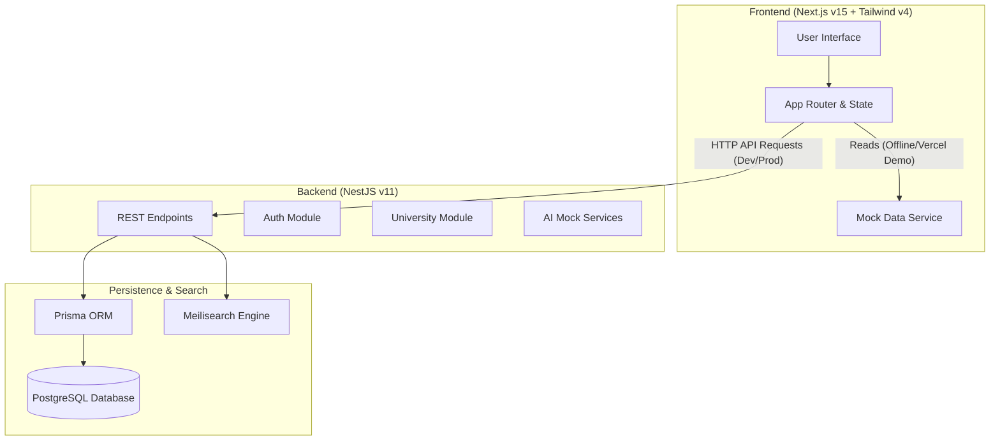

# 🚀 ExamPilot: University Exam Intelligence Platform

ExamPilot is a premium, developer-grade **University Exam Intelligence Platform** designed to help students optimize their revision by focusing on high-return topics. By analyzing patterns, repeat frequencies, and examiner marking rubrics, ExamPilot ensures students study *only* what matters.

[](https://exampilot-theta.vercel.app)
[](./frontend)
[](./backend)
[](https://prisma.io)
[](https://opensource.org/licenses/MIT)

---

## 📐 System Architecture

ExamPilot is built as a modular monorepo. It supports a **fully self-contained Client Prototype Mode** (which runs with high-fidelity mock data on static hosts like Vercel) and **API-Connected Mode** (orchestrated with a PostgreSQL database and Meilisearch engine).



---

## ✨ Features

- 📊 **Question Repeat Frequency**: Clear metrics on how often topics appear in previous year papers.
- 📝 **Model Answers**: Structurings designed for full marks—including introductions, bullet explanations, and conclusions.
- 🎨 **Sketchable SVG Diagrams**: Clear, simple pen-and-paper diagrams that students can easily replicate in exams.
- 🧠 **Active Recall Syllabus Drawers**: Persisted checkmarks that let students track their preparation progress topic by topic.
- 🤖 **AI 1-Day Revision Plan**: Dynamic mock-AI scheduler generating custom revision agendas.
- 🛡️ **Role Selector**: Instant toggle between **Student Mode** (dashboard and revision workspace) and **Admin Mode** (moderation queue and university databases).

---

## 📁 Repository Structure

```text
Exam Pilot/
├── frontend/             # Next.js Application (Vercel Deployable)
│   ├── src/
│   │   ├── app/          # App router pages (Home, Dashboard, Subject, Admin)
│   │   ├── components/   # Header, Footer, and Layout components
│   │   └── lib/          # Custom utility functions and high-fidelity mock data
│   └── tsconfig.json     # Frontend TypeScript config
├── backend/              # NestJS Server
│   ├── src/              # Source code structured by feature modules
│   │   ├── modules/      # Modular system (Auth, DB, Universities, AI Mock)
│   │   └── main.ts       # Server bootstrapped entry point
│   ├── prisma/           # PostgreSQL Schema and Database Seeds
│   └── nest-cli.json     # NestJS compilation settings
├── docker-compose.yml    # Database & Search engine orchestration
└── package.json          # Monorepo task workspace configuration
```

---

## 🛠️ Local Development Setup

### 1. Prerequisites
Ensure you have the following installed:
- [Node.js (v18 or higher)](https://nodejs.org/)
- [Docker & Docker Compose](https://www.docker.com/)
- [Git](https://git-scm.com/)

### 2. Run Database & Search Orchestration
To spin up the PostgreSQL database and Meilisearch search index locally, run:
```bash
docker-compose up -d
```

### 3. Install Workspace Dependencies
Install all package dependencies in the workspace root:
```bash
npm run install:all
```

### 4. Setup Prisma Database Schema & Seed
Generate the Prisma Client, run migrations, and seed initial university mock data:
```bash
cd backend
npx prisma db push
npx prisma db seed
cd ..
```

### 5. Run the Project
Start both servers concurrently from the root directory:
```bash
npm run dev
```

- **Frontend Client**: [http://localhost:3002](http://localhost:3002)
- **Backend API**: [http://localhost:5000](http://localhost:5000)

---

## 🌐 Deployment to Vercel

ExamPilot's frontend is fully optimized for production deployment on **Vercel** as a standalone client application.

### Frontend Deployment Steps (Vercel Console)

1. **Connect Repository**: Import this repository into your Vercel Dashboard.
2. **Configure Settings**:
   - **Framework Preset**: `Next.js`
   - **Root Directory**: `frontend` (Ensure you check this checkbox!)
   - **Build Command**: `next build`
   - **Output Directory**: `.next`
3. **Environment Variables**: No environment variables are strictly required for the offline demo. To connect to a live backend API, add:
   - `NEXT_PUBLIC_API_URL`: Your deployed backend URL (e.g. `https://api.exampilot.com`).
4. **Deploy**: Click "Deploy". Vercel will build and serve your Next.js application at a fast edge-network domain!

---

## 🛠️ Backend Production Deployment Notes

To run the NestJS server in production:
1. **Database**: Spin up a managed PostgreSQL database (e.g. on [Supabase](https://supabase.com) or [Neon](https://neon.tech)).
2. **Environment Variables**: Configure the following env variables on your hosting provider (e.g., [Railway](https://railway.app) or [Render](https://render.com)):
   - `DATABASE_URL`: Managed PostgreSQL connection string.
   - `PORT`: Server port (defaults to `5000`).
3. **Run Migrations & Start**:
   - Run `npx prisma db push` to initialize the database schema.
   - Start the NestJS process with `npm run start:prod`.

---

## 📜 License

Distributed under the MIT License. See `LICENSE` for details.
